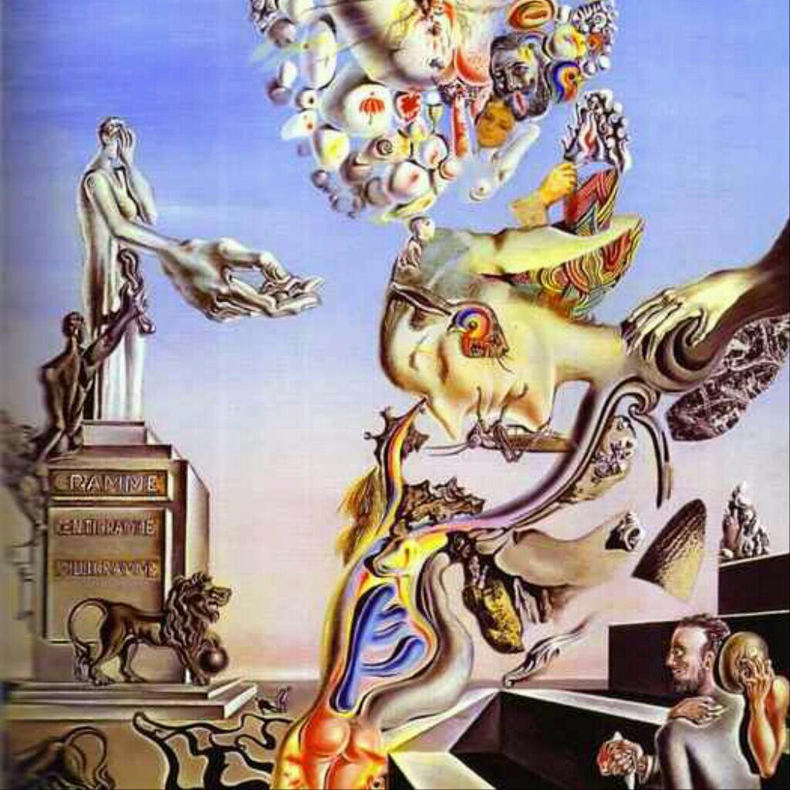

Creators:
    - Justin Diala: Computer Engineering-(Nanoscale Systems Design) University of Alberta Faculty of Engineering
    - Ragur Krishnan: Computer Engineering-(Software) University of Alberta Faculty of Engineering

Project: Image Fusion

Included Files:
    -src folder:
        - README
        - displayImage.cpp
        - WEIGHTED_BIPMATCH_V4.h
        - WEIGHTED_BIPMATCH_V3.h
        - main.cpp
        - CONSTS.cpp
        - CONSTS.h
        - Makefile
    - img folder:
        - contains just images that you can test it out
install the following library:
    - Type the following in the terminal "sudo apt-get install libsfml-dev"

Running instructions:
    - We are assuming that the proper components are installed in the default directory. Which the makefile will take into account.
    - Extract the program and navigate to the files using the terminal.
    - Make sure the files in the "included files section" are present in the directory and that the images are in same directory as the source code.
    - type "make" in the terminal
        - once "python3 imReader.py > test.txt" appears in the terminal type in the image file names in the following order.
            - <image to be manipulated>.jpg
            - <target image>.jpg
        - once the image files have been entered the Hungarian algorithm will run. It might take a while depending on the image size and whether you are running in the VM. We recommend running on native linux to increase speed.
        - once the Hungarian algorithm is done you will be prompted with "Press 1 for BFS effect or 2 for DFS effect: 1"
            - select one to get a different transition effect.

Additional Comments:
    - We can run this on bigger images, but since hungarian algorithm can run time complexity is O(n^3) we would not recommend
    doing it to very large images such as 4k (you might have to wait 1 year for a result :) )
    - We will implement soon the Gaussian Blurring for the images later.
    - Project was originally located in Bitbucket, but is now migrated to Github

References (for Hungarian Algorithm):
    - http://webdocs.cs.ualberta.ca/~zacharyf/courses/combopt_2016/notes/lec19.pdf
    - https://theory.stanford.edu/~tim/w16/l/l5.pdf
    - https://www.cse.ust.hk/~golin/COMP572/Notes/Matching.pdf
    - There is some very good articles in wikipedia also.
    
Some Example Results:

    

